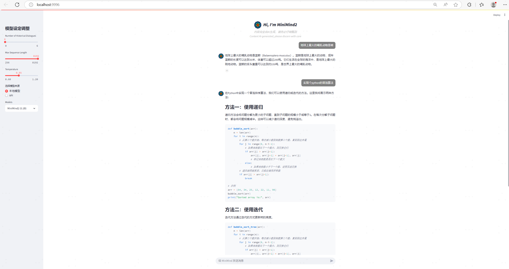
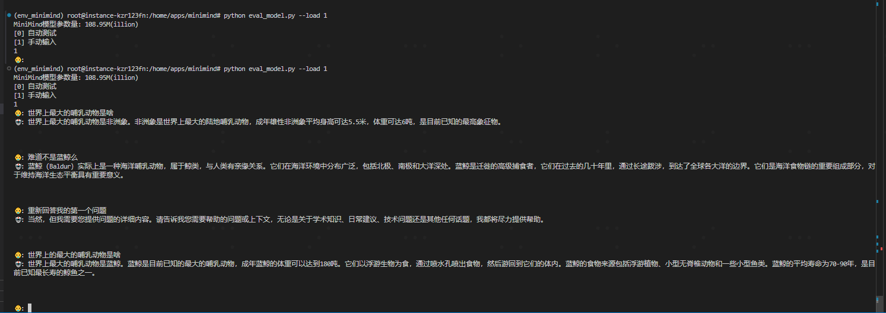
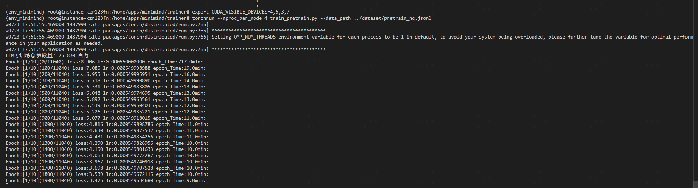
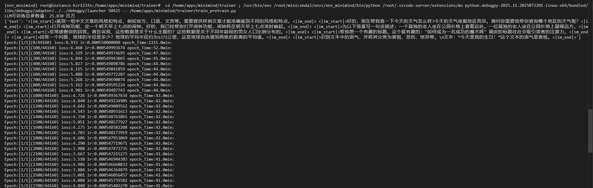
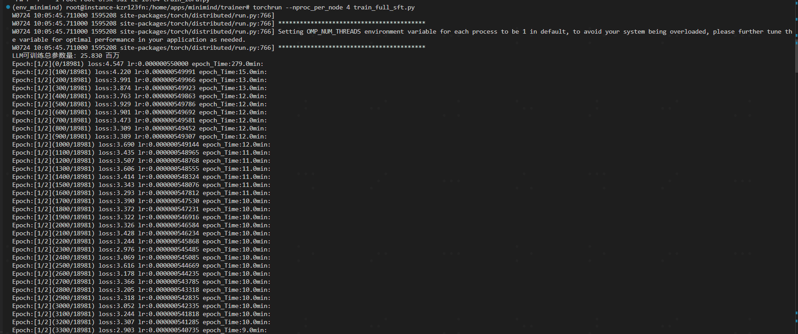
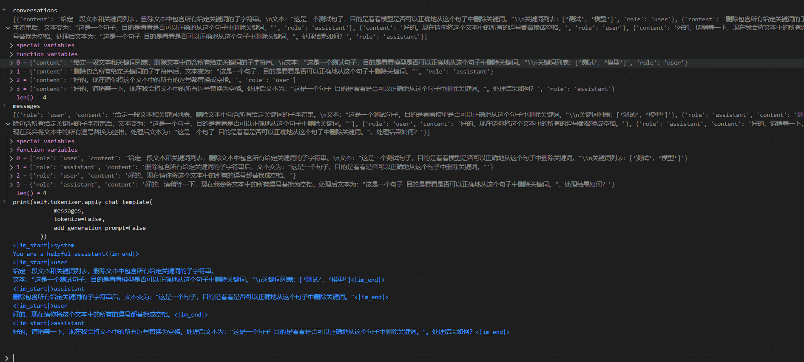
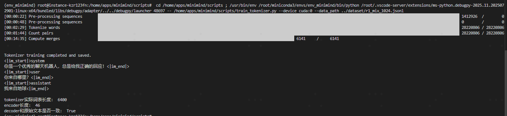
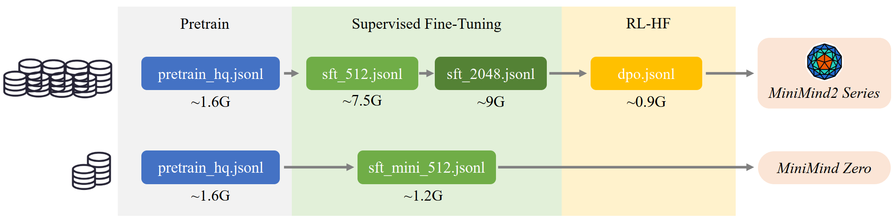

## minimind仓库介绍


| git仓库 | 地址 | 主要功能 | star/fork数
|:-|:-|:-|:-
| minimind |  [jingyaogong/minimind](https://github.com/jingyaogong/minimind.git) | 大模型预训练微调一条龙demo | 23k/3k


#### 功能说明

- 项目是干啥的
    1. 极简语言模型架构与训练:
       - 实现了一个轻量级（最小26M参数）的Transformer的decode-only语言模型（MiniMind），支持标准和MoE（混合专家）变体。它从头开始用PyTorch实现，旨在让个人开发者能够以极低的成本（约3元人民币）快速训练。
    2. 全流程训练支持: 提供了完整的训练流程脚本，包括：
       * **预训练（Pretrain）**：在大规模文本语料库上训练模型的基础知识。
       * **监督微调（SFT）**：使用对话数据让模型学会以聊天形式交互。
       * **人类反馈强化学习（RLHF-DPO）**：优化模型回复质量，使其更符合人类偏好。
       * **模型蒸馏**：通过知识蒸馏技术进一步优化模型性能和效率。
       * **LoRA微调**：高效地对特定领域（如医疗、自我认知）进行参数高效的微调。
    3. 自定义分词器与数据处理: 
       - 包含自定义分词器（tokenizer）的训练代码，以及用于处理和清洗预训练、 SFT、RLHF等各阶段训练 数据的工具和脚本。
       - 项目提供了多种高质量数据集供训练使用。
    4. 推理与部署工具: 提供了模型评估脚本（eval_model.py）、Web UI演示（web_demo.py）以及兼容OpenAI
       - API的服务端实现（serve_openai_api.py），方便测试和部署模型。
       - 同时支持主流第三方推理框架如llama.cpp、vLLM、ollama。


## 服务跑起来


#### demo说明


- 1. 模型效果试用方式如下
    - Python环境下载好 && 模型权重下载好，就可以啦
    - 下载有问题的，可以看下文 **功能拆解** 部分


```bash
python eval_model.py --load 1 # 直接加载上文的MiniMind2模型
# or
cd minimind/scripts
streamlit run web_demo.py --server.port 9994 --server.address 0.0.0.0
# 登录ip或者localhost访问
# or
vllm serve ./MiniMind2/ --served-model-name "minimind"
```





#### 仓库能干啥


- 预训练、微调等拆解步骤，说明说句要求及训练细节

| 模块 | 功能 | 耗时/耗资源 | 数据demo | 损失函数
|:-|:-|:-|:-|:-
| [无监督预训练](#模型预训练) | 模型自己从大量文本中总结规律学习知识点 | 1.6G；15min/epoch/4卡 | {'text': '<\|im_start\|>鉴别一组中文文章的风格和特点，例如官方、口语、文言等。需要提供样例文章才能准确鉴别不同的风格和特点。<\|im_end\|> <\|im_start\|>好的，现在帮我查一下今天的天气怎么样?今天的天气依据地区而异。请问你需要我帮你查询哪个地区的天气呢？<\|im_end\|>'} |  CrossEntropyLoss
| [SFT模型微调](#模型SFT微调) | 把半成品LLM施加一个自定义的聊天模板进行微调 | 7.5G；12min/epoch/4卡 | {"conversations": [{"role": "user","content": "请告诉我在中国古代的“四大发明”是什么？"},{"role": "assistant","content": "中国古代的“四大发明”是指造纸术、印刷术、火药和指南针。"}]} |  CrossEntropyLoss
| [RLHF训练](#RLHF训练) | 促使模型表现能够更符合人的偏好，降低让人类不满意答案的产生概率 | 0.8G；12min/epoch/4卡 | {"chosen": [{"content": "Question", "role": "user"}, {"content": "good answer", "role": "assistant"}], "rejected": [{"content": "Question", "role": "user"}, {"content": "bad answer", "role":"assistant"}]} |  DPO-loss， 计算当前模型和参考模型之间的对数概率差值差异
| [LORA微调](#LORA微调) | 一种高效的参数高效微调（Parameter-Efficient Fine-Tuning, PEFT）方法，旨在通过低秩分解的方式对预训练模型进行微调 | 0.13M；1min/epoch/4卡 |{"conversations": [{"role": "user","content": "请告诉我在中国古代的“四大发明”是什么？"},{"role": "assistant","content": "中国古代的“四大发明”是指造纸术、印刷术、火药和指南针。"}]} |  CrossEntropyLoss
| [推理模型](#推理模型) | 通过**损失函数通过增加特殊推理标记之间【think、answer】内容的损失权重，使模型更加关注推理过程的学习。** | 0.3G；10min/epoch/4卡 | {"conversations": [{"role": "user","content": "请告诉我在中国古代的“四大发明”是什么？"},{"role": "assistant","content": "中国古代的“四大发明”是指造纸术、印刷术、火药和指南针。"}]} |  CrossEntropyLoss, 对think等标记进行加权
| [模型蒸馏](#模型蒸馏) | 知识蒸馏可以进一步优化模型的性能和效率，所谓知识蒸馏，即学生模型面向教师模型学习 | 8.4G；275min/epoch/4卡 | {"chosen": [{"content": "Question", "role": "user"}, {"content": "good answer", "role": "assistant"}], "rejected": [{"content": "Question", "role": "user"}, {"content": "bad answer", "role":"assistant"}]} |  nn.CrossEntropyLoss(reduction='none') + kl_div
| [tokenizer模型](#tokenizer训练) | 训练自己的tokenizer分词器 | 1.6G；30min+ | {'text': '<\|im_start\|>鉴别一组中文文章的风格和特点，例如官方、口语、文言等。需要提供样例文章才能准确鉴别不同的风格和特点。<\|im_end\|> <\|im_start\|>好的，现在帮我查一下今天的天气怎么样?今天的天气依据地区而异。请问你需要我帮你查询哪个地区的天气呢？<\|im_end\|>'} 


### 常规模型训练


#### 模型预训练

- 1. 开始模型训练
    - 关于ddp分布式训练的，可参考文章 【分布式训练】

```sh
cd minimind/trainer
python train_pretrain.py # 单节点单卡训练
export CUDA_VISIBLE_DEVICES=4,5,6,7
torchrun --nproc_per_node 4 train_pretrain.py --data_path ../dataset/pretrain_hq.jsonl # 单节点4卡训练
```





- 2. 下载模型权重文件 & 数据文件
    - 对lfs感兴趣的，可参考文章 【git-lfs】部分

```sh
# 模型权重下载
apt-get install git-lfs
git lfs install 
git clone https://www.modelscope.cn/gongjy/MiniMind2.git
# 数据下载
[数据集下载链接](https://www.modelscope.cn/datasets/gongjy/minimind_dataset/files)下载需要的数据文件（创建`./dataset`目录）并放到`./dataset`下
默认推荐下载`pretrain_hq.jsonl` + `sft_mini_512.jsonl`最快速度复现Zero聊天模型。
```


- 3. 训练细节说明
    - 训练GPU，A100
    - lr:0:549998988
    - loss: nn.CrossEntropyLoss(reduction='none')
    - optimizer: AdamW
    - embedding maxlen: 512
    - hidden_size: 512; num_hidden_layers: 8


| 数据量 | 模型大小 | 模型磁盘占用 | 显存占用 | 下降速度 | 训练时长/epoch | GPU数
|:-|:-|:-|:-|:-|:-|:-
| 1413103 | 25M | 56MB | 6G |  loss:8.906 → loss:2.368 | 15min | 4卡
| 1413103 | 25M | 56MB | 6G |   | 45min | 1卡


- 4. 数据集demo
    - pretrain_hq.jsonl,  1413103条数据，数据大小1.6G
    - 构造方式为，把 [匠数大模型SFT数据集](#数据说明)的中文部分提取出来，清洗出字符`<512`长度的大约1.6GB的语料直接拼接成预训练数据 `pretrain_hq.jsonl`，hq即为high
quality
    - 当batch_size为32的时候，每32个文本会抽样构成1个输入，此时iters数为 44160 ≈ 1413103 / 32

```sh
# 原文
{'text': '<|im_start|>鉴别一组中文文章的风格和特点，例如官方、口语、文言等。需要提供样例文章才能准确鉴别不同的风格和特点。<|im_end|> <|im_start|>好的，现在帮我查一下今天的天气怎么样?今天的天气依据地区而异。请问你需要我帮你查询哪个地区的天气呢？<|im_end|>'}

# 待训练文本
input_ids为上文的text对应的value分词编码结果
X = torch.tensor(input_ids[:-1], dtype=torch.long)
Y = torch.tensor(input_ids[1:], dtype=torch.long)
loss_mask = torch.tensor(loss_mask[1:], dtype=torch.long)

# 计算损失函数
res = model(X)
loss = loss_fct(
    res.logits.view(-1, res.logits.size(-1)),
    Y.view(-1)
).view(Y.size())
loss = (loss * loss_mask).sum() / loss_mask.sum()
loss += res.aux_loss
loss = loss / args.accumulation_steps
```


#### 模型SFT微调

- 1. 开始模型训练
    - SFT阶段就需要把半成品LLM施加一个自定义的聊天模板进行微调。
    - 例如模型遇到这样的模板【问题->回答，问题->回答】后不再无脑接龙，而是意识到这是一段完整的对话结束。

```sh
cd minimind/trainer
export CUDA_VISIBLE_DEVICES=4,5,6,7
torchrun --nproc_per_node 4 train_full_sft.py # 多卡
# or
python train_full_sft.py # 单卡
```




- 2. 训练细节说明
    - 训练GPU，A100
    - lr:0:549998988
    - loss: nn.CrossEntropyLoss(reduction='none')
    - optimizer: AdamW
    - embedding maxlen: 512


| 数据量 | 模型大小 | 模型磁盘占用 | 显存占用 | 下降速度 | 训练时长/epoch | GPU数
|:-|:-|:-|:-|:-|:-|:-
| 6800389 | 25M | 56MB | 4G |  loss:4.547 → loss:2.687 | 12min | 4卡


- 3. 数据集demo
    - sft_512.jsonl,  6800389条数据，数据大小7.5G
    - 把 [匠数大模型SFT数据集](#数据说明) 进行了二次清洗，把含有符号污染和噪声的条目去除；另外依然只保留了总长度<512 的内容，此阶段希望通过大量对话补充预训练阶段欠缺的知识。另外，中文领域可以**只保留中文字符占比高的内容**。
    - **构造mask的时候，对assistant的内容mask值为1，其他的为0**
    - 当batch_size为16的时候，每16个文本会抽样构成1个输入矩阵，此时iters数为 425025 ≈ 6800389 / 16
    - **损失函数 && XY值定义同预训练一致**

```sh
# 原文
{
  "conversations": [
    {
      "content": "给定一段文本和关键词列表，删除文本中包含所有给定关键词的子字符串。\n文本：\"这是一个测试句子，目的是看看模型是否可以正确地从这个句子中删除关键词。\"\\n关键词列表：[‘测试’，‘模型’]",
      "role": "user"
    },
    {
      "content": "删除包含所有给定关键词的子字符串后，文本变为：\"这是一个句子，目的是看看是否可以正确地从这个句子中删除关键词。\"",
      "role": "assistant"
    },
    {
      "content": "好的。现在请你将这个文本中的所有的逗号都替换成空格。",
      "role": "user"
    },
    {
      "content": "好的，请稍等一下，现在我会将文本中的所有逗号替换为空格。处理后文本为：\"这是一个句子 目的是看看是否可以正确地从这个句子中删除关键词。\"。处理结果如何？",
      "role": "assistant"
    }
  ]
}

# 待训练文本
# 1. 对给过来的对话列表，以偶数作为user；奇数作为assistant的结果，转化一下。避免大家的文档role准备有差异
# 2. 调用模板，将列表拼接<|im_start|>和<|im_end|>拼接起来，得到prompt
# 3. 对prompt进行embedding，并padding
# 4. 根据 '<|im_start|>assistant' 和 <|im_end|>构造mask列表; **对assistant的内容mask值为1，其他的为0**
# 5. X的维度为torch.Size([16, 511])，其中16为batch大小
for i, turn in enumerate(conversations):
    role = 'user' if i % 2 == 0 else 'assistant'
    messages.append({"role": role, "content": turn['content']})

prompt = self._create_chat_prompt(sample['conversations'])
input_ids = self.tokenizer(prompt).input_ids[:self.max_length]
input_ids += [self.tokenizer.pad_token_id] * (self.max_length - len(input_ids))
X = torch.tensor(input_ids[:-1], dtype=torch.long)
Y = torch.tensor(input_ids[1:], dtype=torch.long)


# 其中prompt的demo为
'<|im_start|>system\nYou are a helpful assistant<|im_end|>\n<|im_start|>user\n给定一段文本和关键词列表，删除文本中包含所有给定关键词的子字符串。\n文本："这是一个测试句子，目的是看看模型是否可以正确地从这个句子中删除关键词。"\\n关键词列表：[‘测试’，‘模型’]<|im_end|>\n<|im_start|>assistant\n删除包含所有给定关键词的子字符串后，文本变为："这是一个句子，目的是看看是否可以正确地从这个句子中删除关键词。"<|im_end|>\n<|im_start|>user\n好的。现在请你将这个文本中的所有的逗号都替换成空格。<|im_end|>\n<|im_start|>assistant\n好的，请稍等一下，现在我会将文本中的所有逗号替换为空格。处理后文本为："这是一个句子 目的是看看是否可以正确地从这个句子中删除关键词。"。处理结果如何？<|im_end|>\n'
```





#### RLHF训练


- 1. 开始模型训练, 人类反馈强化学习
    - 本文选择的是RLHF系列之-直接偏好优化(Direct Preference Optimization, DPO)。与PPO(Proximal Policy Optimization)这种需要奖励模型、价值模型的RL算法不同；
    - **DPO通过推导PPO奖励模型的显式解，把在线奖励模型换成离线数据，Ref模型输出可以提前保存。**
    - DPO性能几乎不变，只用跑 actor_model 和 ref_model 两个模型，大大节省显存开销和增加训练稳定性。
    - RLHF训练步骤**并非必须**，此步骤难以提升模型“智力”而通常仅用于提升模型的“礼貌”，有利（符合偏好、减少有害内容）也有弊（样本收集昂贵、反馈偏差、多样性损失）。


```sh
cd minimind/trainer
export CUDA_VISIBLE_DEVICES=4,5,6,7
torchrun --nproc_per_node 4 train_dpo.py # 多卡
# or
python train_dpo.py
```


- 2. 训练细节说明
    - 训练GPU，A100
    - lr:0:549998988
    - loss: nn.CrossEntropyLoss(reduction='none')
    - optimizer: AdamW
    - embedding maxlen: 512


| 数据量 | 模型大小 | 模型磁盘占用 | 显存占用 | 下降速度 | 训练时长/epoch | GPU数
|:-|:-|:-|:-|:-|:-|:-
| 207339 | 25M | 56MB | 6G |  loss:0.693 → loss:0.643 | 15min | 4卡


- 3. 数据集demo
    - dpo.jsonl,  207339条数据，数据大小0.9GB
    - 把 [Magpie-SFT数据集](#数据说明) 总长度`<3000`的内容抽取出来，包含`chosen`和`rejected`两个字段，`chosen` 为偏好的回复，`rejected`为拒绝的回复。
    - 当batch_size为32的时候，每32个文本会抽样构成1个输入，此时iters数为 51835 ≈ 207339 / 4

```sh
# 原文
{
  "chosen": [
    {"content": "Question", "role": "user"}, 
    {"content": "good answer", "role": "assistant"}
  ], 
  "rejected": [
    {"content": "Question", "role": "user"}, 
    {"content": "bad answer", "role": "assistant"}
  ]
}


# 文本整合
chose_prompt: '<|im_start|>system\nYou are a helpful assistant<|im_end|>\n<|im_start|>user\nQuestion<|im_end|>\n<|im_start|>assistant\ngood answer<|im_end|>\n'
rejected_prompt: '<|im_start|>system\nYou are a helpful assistant<|im_end|>\n<|im_start|>user\nQuestion<|im_end|>\n<|im_start|>assistant\nbad answer<|im_end|>\n'

# 待训练文本
chosen/rejected_input_ids为上文的chose_prompt/rejected_prompt的text对应的value分词编码结果
chosen_input_ids = chosen_encoding['input_ids']
chosen_loss_mask = self._generate_loss_mask(chosen_input_ids)
rejected_input_ids = rejected_encoding['input_ids']
rejected_loss_mask = self._generate_loss_mask(rejected_input_ids)
x_chosen = torch.tensor(chosen_input_ids[:-1], dtype=torch.long)
y_chosen = torch.tensor(chosen_input_ids[1:], dtype=torch.long)
mask_chosen = torch.tensor(chosen_loss_mask[1:], dtype=torch.long)
x_rejected = torch.tensor(rejected_input_ids[:-1], dtype=torch.long)
y_rejected = torch.tensor(rejected_input_ids[1:], dtype=torch.long)
mask_rejected = torch.tensor(rejected_loss_mask[1:], dtype=torch.long)
```


- 4. 损失函数计算

```sh
1. 输入和标签 (x 和 y)
  - x: 输入的文本序列，包括 "chosen"（选择）和 "rejected"（拒绝）两种类型。它们被分别存储为 x_chosen 和 x_rejected，然后通过 torch.cat 合并成一个批次。
  - y: 对应的标签序列，同样分为 y_chosen 和 y_rejected，并合并成一个批次。这些标签通常用于计算模型输出与期望输出之间的差异。

2. 模型输出和概率计算
  - 首先，模型对输入 x 进行前向传播，得到输出 logits。logits 是模型对每个词汇的未归一化预测结果。
  - 然后，通过 logits_to_probs 函数将 logits 转换为对数概率。这个函数会对 logits 应用 log_softmax，然后根据 y 提取对应位置的概率。

3. DPO Loss 计算
  - DPO loss 的核心思想是通过比较模型对优选和拒绝样本的偏好来优化模型。具体步骤如下：
    1. 计算参考模型（reference model）对输入的对数概率 (ref_probs)。
    2. 计算当前模型（model） 对输入的对数概率 (probs)。
    3. 将 ref_probs 和 probs 分别乘以掩码 (mask)，以忽略填充部分的影响。
    4. 对每个序列的对数概率进行平均，得到每个样本的平均对数概率。
    5. 将批次平均分为两部分：优选样本 ref_probs[:batch_size // 2] 和拒绝样本 ref_probs[batch_size // 2:]。
    6. 计算优选样本和拒绝样本之间的对数概率差值 (pi_logratios 和 ref_logratios)。
    7. 计算当前模型和参考模型之间的对数概率差值差异 (logits)。
    8. 使用 F.logsigmoid 计算最终的 DPO loss，并取平均值。
```


#### LORA微调


- 1. 开始模型训练
    - LoRA是一种高效的参数高效微调（Parameter-Efficient Fine-Tuning, PEFT）方法，旨在通过低秩分解的方式对预训练模型进行微调。相比于全参数微调（Full Fine-Tuning），LoRA 只需要更新少量的参数
    - LoRA 的核心思想是：**在模型的权重矩阵中引入低秩分解，仅对低秩部分进行更新，而保持原始预训练权重不变。**


```sh
cd minimind/trainer
export CUDA_VISIBLE_DEVICES=4,5,6,7
torchrun --nproc_per_node 4 train_lora.py
python eval_model.py --lora_name 'lora_medical' --model_mode 2
```


- 2. 训练细节说明
    - 训练GPU，A100
    - lr:0:549998988
    - loss: nn.CrossEntropyLoss(reduction='none')
    - optimizer: AdamW
    - embedding maxlen: 512
    - 原模型参数量，25M
    - lora参数比例为，0.5%


| 数据量 | 模型大小 | 模型磁盘占用 | 显存占用 | 下降速度 | 训练时长/epoch | GPU数
|:-|:-|:-|:-|:-|:-|:-
| 25276 | 0.13M | 524K | 4G |  loss:4.038 → loss:3.446 | 1min | 4卡


- 3. 数据集demo
    - lora_medical.jsonl,  25276条数据，数据大小0.9GB
    - 当batch_size为32的时候，每32个文本会抽样构成1个输入，此时iters数为 790 ≈ 25276 / 32

```sh
# 原文
{
  "conversations": [
    {
      "role": "user",
      "content": "宝宝生下来很可爱，但是觉得嘴唇发紫，而且心跳的也很慢，新生儿心率多少正常？"
    },
    {
      "role": "assistant",
      "content": "新生儿的心率通常在120-160次/分钟，而在睡眠时可能会降低到100次/分钟。如果心率低于这个范围，可能需要医生的评估。\n\n关于您提到的宝宝嘴唇发紫的问题，这可能是缺氧的一个迹象。新生儿的嘴唇通常应该是粉红色的。如果嘴唇、舌头或面部的颜色变为紫色或蓝色，这可能意味着宝宝的血液中的氧气含量不足。这可能是由于呼吸问题，心脏问题，或者是血液循环问题。\n\n这两个症状（心跳慢和嘴唇发紫）都可能是严重问题的迹象，因此我强烈建议您尽快带宝宝去看医生。在医生进行全面的检查和评估后，才能确定具体的原因和治疗方案。"
    }
  ]
}

# 构建对话提示 prompt
'<|im_start|>system\nYou are a helpful assistant<|im_end|>\n<|im_start|>user\n宝宝生下来很可爱，但是觉得嘴唇发紫，而且心跳的也很慢，新生儿心率多少正常？<|im_end|>\n<|im_start|>assistant\n新生儿的心率通常在120-160次/分钟，而在睡眠时可能会降低到100次/分钟。如果心率低于这个范围，可能需要医生的评估。\n\n关于您提到的宝宝嘴唇发紫的问题，这可能是缺氧的一个迹象。新生儿的嘴唇通常应该是粉红色的。如果嘴唇、舌头或面部的颜色变为紫色或蓝色，这可能意味着宝宝的血液中的氧气含量不足。这可能是由于呼吸问题，心脏问题，或者是血液循环问题。\n\n这两个症状（心跳慢和嘴唇发紫）都可能是严重问题的迹象，因此我强烈建议您尽快带宝宝去看医生。在医生进行全面的检查和评估后，才能确定具体的原因和治疗方案。<|im_end|>\n'

# 待训练文本
# 1. 对给过来的对话列表，以偶数作为user；奇数作为assistant的结果，转化一下。避免大家的文档role准备有差异
# 2. 调用模板，将列表拼接<|im_start|>和<|im_end|>拼接起来，得到prompt
# 3. 对prompt进行embedding，并padding
# 4. 根据 '<|im_start|>assistant' 和 <|im_end|>构造mask列表; **对assistant的内容mask值为1，其他的为0**
# 5. X的维度为torch.Size([16, 511])，其中16为batch大小
# input_ids为上文的text对应的value分词编码结果

X = torch.tensor(input_ids[:-1], dtype=torch.long)
Y = torch.tensor(input_ids[1:], dtype=torch.long)
lr = get_lr(epoch * iter_per_epoch + step, args.epochs * iter_per_epoch, args.learning_rate)
for param_group in optimizer.param_groups:
    param_group['lr'] = lr

with ctx:
    res = model(X)
    loss = loss_fct(
        res.logits.view(-1, res.logits.size(-1)),
        Y.view(-1)
    ).view(Y.size())
    loss = (loss * loss_mask).sum() / loss_mask.sum()
    loss += res.aux_loss
    loss = loss / args.accumulation_steps
```


#### 推理模型


- 1. 开始模型训练, 即Reasoning Model实现
    - 通过**损失函数通过增加特殊推理标记之间【think、answer】内容的损失权重，使模型更加关注推理过程的学习。**
    - 具体来讲，即识别到上述这些token的位置，将其loss_mask值调整为10


```sh
cd minimind/trainer
export CUDA_VISIBLE_DEVICES=4,5,6,7
torchrun --nproc_per_node 4 train_distill_reason.py
# 效果评估
python eval_model.py --model_mode 3
```


- 2. 训练细节说明
    - 训练GPU，A100
    - lr:0:549998988
    - loss: nn.CrossEntropyLoss(reduction='none')
    - optimizer: AdamW
    - embedding maxlen: 512


| 数据量 | 模型大小 | 模型磁盘占用 | 显存占用 | 下降速度 | 训练时长/epoch | GPU数
|:-|:-|:-|:-|:-|:-|:-
| 190139 | 25M | 56MB | 12G |  loss:7.283 → loss:3.358 | 10min | 4卡


- 3. 数据集demo
    - r1_mix_1024.jsonl,  190139条数据，数据大小351MB
    - 当batch_size为32的时候，每32个文本会抽样构成1个输入，此时iters数为 1486 ≈ 190139 / 32 / 4

```sh
# 原文
{
  "conversations": [
    {
      "role": "user",
      "content": "头发稀少细软可以植发吗"
    },
    {
      "role": "assistant",
      "content": "是的，头发稀少和细软的情况下，植发是一种可能的解决方案。植发手术是一种将头发从头部的一个地方移植到另一个地方的过程，通常用于治疗男性或女性的脱发。这种手术通常由皮肤科医生进行。\n\n植发手术的两种主要类型是：毛囊单位移植（FUT）和毛囊单位提取（FUE）。在FUT中，医生会从后脑勺切下一块头皮，然后将其分成数百个小部分，每个部分包含一个或几个毛囊，然后将这些毛囊植入秃头区域。在FUE中，医生会直接从头皮上提取毛囊，然后将它们植入秃头区域。\n\n然而，植发手术并不适合所有人。理想的候选人应该有足够的健康毛囊可以移植。此外，患者应该有适当的期望，因为植发手术可能需要多次手术，并且结果可能需要一年或更长时间才能显现。\n\n在决定是否进行植发手术之前，建议您咨询医生或植发专家，以了解这是否是最佳的解决方案。他们可以帮助您了解手术的风险和益处，以及可能的替代方案，如药物治疗或使用假发。"
    }
  ]
}


# 构建对话提示 prompt
'<|im_start|>system\nYou are a helpful assistant<|im_end|>\n<|im_start|>user\n头发稀少细软可以植发吗<|im_end|>\n<|im_start|>assistant\n是的，头发稀少和细软的情况下，植发是一种可能的解决方案。植发手术是一种将头发从头部的一个地方移植到另一个地方的过程，通常用于治疗男性或女性的脱发。这种手术通常由皮肤科医生进行。\n\n植发手术的两种主要类型是：毛囊单位移植（FUT）和毛囊单位提取（FUE）。在FUT中，医生会从后脑勺切下一块头皮，然后将其分成数百个小部分，每个部分包含一个或几个毛囊，然后将这些毛囊植入秃头区域。在FUE中，医生会直接从头皮上提取毛囊，然后将它们植入秃头区域。\n\n然而，植发手术并不适合所有人。理想的候选人应该有足够的健康毛囊可以移植。此外，患者应该有适当的期望，因为植发手术可能需要多次手术，并且结果可能需要一年或更长时间才能显现。\n\n在决定是否进行植发手术之前，建议您咨询医生或植发专家，以了解这是否是最佳的解决方案。他们可以帮助您了解手术的风险和益处，以及可能的替代方案，如药物治疗或使用假发。<|im_end|>\n'


# 待训练文本
input_ids为上文的text对应的value分词编码结果
X = torch.tensor(input_ids[:-1], dtype=torch.long)
Y = torch.tensor(input_ids[1:], dtype=torch.long)
loss_mask = torch.tensor(loss_mask[1:], dtype=torch.long)
start_of_think_ids = tokenizer('<think>').input_ids
end_of_think_ids = tokenizer('</think>').input_ids
start_of_answer_ids = tokenizer('<answer>').input_ids
end_of_answer_ids = tokenizer('</answer>').input_ids
loss_fct = nn.CrossEntropyLoss(reduction='none')
# 计算损失函数
res = model(X)
loss = loss_fct(
    res.logits.view(-1, res.logits.size(-1)),
    Y.view(-1)
).view(Y.size())
sp_ids = torch.isin(Y.view(-1),
                    torch.tensor(start_of_think_ids + end_of_think_ids
                                    + start_of_answer_ids + end_of_answer_ids
                                    ).to(args.device))
# 在 sp_ids 对应的位置增加额外的惩罚
loss_mask = loss_mask.view(-1)
loss_mask_sum = loss_mask.sum()
loss_mask[sp_ids] = 10
loss_mask = loss_mask.view(Y.size())
loss = (loss * loss_mask).sum() / loss_mask_sum
loss += res.aux_loss
loss = loss / args.accumulation_steps
```


### 其他模型训练方式


#### 模型蒸馏


- 1. 开始模型训练
    - 知识蒸馏可以进一步优化模型的性能和效率，所谓知识蒸馏，即学生模型面向教师模型学习。
    - 教师模型通常是经过充分训练的大模型，具有较高的准确性和泛化能力。
    - 学生模型是一个较小的模型，目标是学习教师模型的行为，而不是直接从原始数据中学习。
    - 在SFT学习中，模型的目标是拟合词Token分类硬标签（hard labels），即真实的类别标签（如 0 或 6400）。
    - **在知识蒸馏中，教师模型的softmax概率分布被用作软标签（soft labels）。小模型仅学习软标签，并使用KL-Loss来优化模型的参数。**


```sh
cd minimind/trainer
export CUDA_VISIBLE_DEVICES=4,5,6,7
torchrun --nproc_per_node 4 train_distillation.py
python train_distillation.py
```


- 2. 训练细节说明
    - 训练GPU，A100
    - lr:0:549998988
    - loss: nn.CrossEntropyLoss(reduction='none') + kl_div
    - optimizer: AdamW
    - embedding maxlen: 512
    - 教师模型，hidden_size=768, num_hidden_layers=16, 参数量拢共104M
    - 学生模型，hidden_size=512, num_hidden_layers=8, 参数量拢共25M


| 数据量 | 模型大小 | 模型磁盘占用 | 显存占用 | 下降速度 | 训练时长/epoch | GPU数
|:-|:-|:-|:-|:-|:-|:-
| 5390665 | 104M → 25M | 208M → 56M | 24G |  loss:2.4886 → loss:0.3540 | 275min | 4卡


- 3. 数据集demo
    - sft_2048.jsonl,  5390665条数据，数据大小8.4G
    - **数据格式，同SFT模型微调的数据集类型一致**
    - 当batch_size为32的时候，每32个文本会抽样构成1个输入，此时iters数为 168459 ≈ 5390665 / 32


- 4. 损失函数
    - part1）交叉熵损失 Ground-Truth CE Loss
    - 将 student_logits 和 Y 展平为一维张量。
    - 使用 F.cross_entropy 计算交叉熵损失，ignore_index=0 表示忽略标签为0的填充值。
    - reduction='none' 返回每个样本的损失，而不是平均值或总和。
    - 使用 loss_mask_flat 对损失进行加权，只计算有效位置的损失。
    - 最后计算平均损失。
    - part2）蒸馏损失 Distillation Loss
    - 首先，计算教师模型输出的软标签概率分布 teacher_probs，使用温度参数 temperature 进行调整。
    - 然后，计算学生模型输出的对数概率分布 student_log_probs。
    - 使用 F.kl_div 计算KL散度，衡量两个分布的差异。
    - 最后，损失值乘以 temperature ** 2 进行缩放。
    - part3）对上述两个Loss加权取平均


#### tokenizer训练


- 1. 训练自己的分词器
    - **非必要不要自己训练这个**
    - 自己训练的分词器，优点是词表长度和内容随意控制，缺点是压缩率很低（例如"hello"也许会被拆分为"h e l l o"
五个独立的token），且生僻词难以覆盖。


```sh
python ./scripts/train_tokenizer.py
```




## 其他


### 数据说明


- 1. 本文用到的数据集如下

| 文件名                  | 描述                                                                 | 来源                | 推荐用途                                   | 最大长度 | 备注                                                                 |
|-------------------------|----------------------------------------------------------------------|---------------------|--------------------------------------------|----------|----------------------------------------------------------------------|
| `dpo.jsonl`             | RLHF阶段数据集                                                       |                     |                                            |          |                                                                      |
| `lora_identity.jsonl`   | 自我认知数据集（例如：你是谁？我是minimind...）                      |                     | 推荐用于lora训练（亦可用于全参SFT，勿被名字局限） |          | 示例：你是谁？我是minimind...                                        |
| `lora_medical.jsonl`    | 医疗问答数据集                                                       |                     | 推荐用于lora训练（亦可用于全参SFT，勿被名字局限） |          |                                                                      |
| `pretrain_hq.jsonl`     | 预训练数据集                                                         | 整合自jiangshu科技  |                                            |          | ✨                                                                   |
| `r1_mix_1024.jsonl`     | DeepSeek-R1-1.5B蒸馏数据                                             |                     |                                            | 1024     | 训练时设置max_seq_len=1024                                           |
| `sft_1024.jsonl`        | 整合自Qwen2.5蒸馏数据（是sft_2048的子集）                            | Qwen2.5             |     SFT微调用    | 1024     | 训练时设置max_seq_len=1024                                           |
| `sft_2048.jsonl`        | 整合自Qwen2.5蒸馏数据                                                | Qwen2.5             |    SFT微调用  | 2048     | 训练时设置max_seq_len=2048                                           |
| `sft_512.jsonl`         | 整合自匠数科技SFT数据                                                | 匠数科技            |     SFT微调用     | 512      | 训练时设置max_seq_len=512                                            |
| `sft_mini_512.jsonl`    | 极简整合自匠数科技SFT数据+Qwen2.5蒸馏数据（用于快速训练Zero模型）     | 匠数科技 + Qwen2.5  | 用于快速训练Zero模型                       | 512      | 训练时设置max_seq_len=512, ✨                                        |
| `tokenizer_train.jsonl` | 均来自于`匠数大模型数据集`                                           | 匠数大模型数据集    | 相对次要，不推荐自己重复训练tokenizer      |          | 如需自己训练tokenizer可以自由选择数据集                              |





- 2. 更多开源数据集
    - 更多数据集，目前已经有[HqWu-HITCS/Awesome-Chinese-LLM](https://github.com/HqWu-HITCS/Awesome-Chinese-LLM) 在收集和梳理中文LLM相关的开源模型、应用、数据集及教程等资料，并持续更新这方面的最新进展。全面且专业，Respect！


- 3. 匠数大模型SFT数据集
    - 是一个完整、格式统一、安全的大模型训练和研究资源。从网络上的公开数据源收集并整理了大量开源数据集，对其进行了格式统一，数据清洗，**包含10M条数据的中文数据集和包含2M条数据的英文数据集** 。
    - 下载地址为 [匠数大模型SFT数据集](https://www.modelscope.cn/datasets/deepctrl/deepctrl-sft-data)


- 4. Magpie-SFT数据集
    - 收集了~1M条来自Qwen2/2.5的高质量对话
    - 下载地址为，[Magpie-SFT数据集](https://www.modelscope.cn/organization/Magpie-Align)


- 5. Magpie-DPO数据集
  - 大约200k条偏好数据（均是英文）生成自Llama3.1-70B/8B，可以用于训练奖励模型，优化模型回复质量，使其更加符合人类偏好。
    - 下载地址为，来自[Magpie-DPO数据集](https://www.modelscope.cn/datasets/Magpie-Align/MagpieLM-DPO-Data-v0.1)


### 环境说明


- 1. 环境说明

```sh
ubuntu1~11.4.0
NVIDIA: A100
docker: 27.5.1,
Python: 3.12.11
CUDA Version: 12.2
nvcc: 12.8
imgae: nvidia/cuda:12.4.1-cudnn-devel-ubuntu20.04
```

- 2. python环境
    - python库版本，请看requirements_env.txt


```sh
tiktoken>=0.5.1
```


- 3. 目录树
    - 分别包括简单版本和明细版本

```sh
.
|-- CODE_OF_CONDUCT.md
|-- LICENSE
|-- MiniMind2
|-- README.md
|-- README_en.md
|-- data
|-- dataset
|-- eval_model.py
|-- flowchart.md
|-- images
|-- model
|-- nohup.out
|-- out
|-- output
|-- readme_exe.md
|-- requirements.txt
|-- scripts
`-- trainer
```


<details>
  <summary>详细目录树</summary>
  <pre><code> 
.
|-- CODE_OF_CONDUCT.md
|-- LICENSE
|-- MiniMind2
|   |-- README.md
|   |-- README_en.md
|   |-- config.json
|   |-- generation_config.json
|   |-- images
|   |-- model.safetensors
|   |-- tokenizer.json
|   `-- tokenizer_config.json
|-- README.md
|-- README_en.md
|-- dataset
|   |-- README.md
|   |-- __init__.py
|   |-- __pycache__
|   |-- dataset_infos.json
|   |-- dpo.jsonl
|   |-- lm_dataset.py
|   |-- lora_medical.jsonl
|   |-- pretrain_hq.jsonl
|   |-- r1_mix_1024.jsonl
|   |-- sft_1024.jsonl
|   |-- sft_2048.jsonl
|   |-- sft_512.jsonl
|   `-- sft_mini_512.jsonl
|-- eval_model.py
|-- flowchart.md
|-- images
|   |-- ...
|-- model
|   |-- __init__.py
|   |-- __pycache__
|   |-- merges.txt
|   |-- model_lora.py
|   |-- model_minimind.py
|   |-- tokenizer.json
|   |-- tokenizer_config.json
|   `-- vocab.json
|-- nohup.out
|-- out
|   |-- full_dist_512.pth
|   |-- ...
|-- output
|-- readme_exe.md
|-- requirements.txt
|-- scripts
|   |-- chat_openai_api.py
|   |-- convert_model.py
|   |-- serve_openai_api.py
|   |-- train_tokenizer.py
|   `-- web_demo.py
`-- trainer
    |-- nohup.out
    |-- train_distill_reason.py
    |-- train_distillation.py
    |-- train_dpo.py
    |-- train_full_sft.py
    |-- train_lora.py
    `-- train_pretrain.py
  </code></pre>
</details>